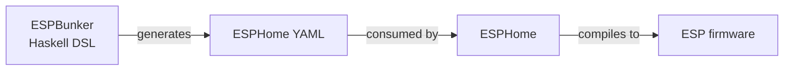

# ESPBunker

ESPBunker is a Haskell DSL for describing ESPHome configurations using
the indexed free monad that has two interpreters:

- `generateYAML`: generates ESPHome YAML files.
- `generateReport`: generates a small report.

ESPBunker does not replace ESPHome or add new device capabilities. It
generates ordinary ESPHome YAML files, which can then be passed to
ESPHome to build the device firmware:



## Components Supported

- Binary sensors
- Covers
- Lights (RGB, monochromatic, CWWW)
- Numbers
- Outputs
- Scripts
- Sensors
- Switches

## ESPM

The main type `ESPM from to a` represents an indexed computation (IxFree)
that transforms the system state from type `from` to type `to`, producing
a result of type `a`.

```haskell
type ESPM from to a = IxFree ESPF from to a
```

The `ESPF` functor (`IxFunctor`) defines operations for building ESPHome
configurations, with indices tracking the state of the system (pins
and names):

```haskell
data ESPF :: Type -> Type -> Type -> Type where
  -- The board is already tracked in the index, so MkBoard carries no payload.
  MkBoard :: next -> ESPF board board next
  MkSwitch ::
    forall name platform pin board next.
    ( KnownSymbol name,
      KnownNat pin,
      -- The board tracks used names and available GPIO/ADC/LEDC pins.
      AssertNameIsAvailable name (GetNames board),
      AssertPinIsAvailable
        PinGPIO
        pin
        (GetGPIOPins board)
        (GetADCPins board)
        (GetLEDCPins board),
      KnownSymbol (PlatformToSymbol platform)
    ) =>
    SwitchOptions -> next -> ESPF board (AddPinComponent name pin board) next
  ...
```

This allows the type system to track resources throughout the computation:

- Type-level lists track used names and available GPIO/ADC/LEDC pins.

- Type families ensure valid platform/component combinations.

- Custom type-level assertions prevent duplicate names and the usage of
  non available pins (non-existent or already used).

- Indexed state transitions ensure that each operation updates the
  compile-time representation of the board.

## Example Usage

```haskell
type ESP32C3 =
  Board
    "esp32-c3-devkitm-1"
    '[] -- used names
    '[0, 1, 2, 3, 4, 5, 6, 7, 8, 9, 10, 18, 19, 20, 21] -- GPIO pins
    '[0, 1, 2, 3, 4, 5, 6, 7, 8, 9, 10] -- ADC pins
    '[0, 1, 2, 3, 4, 5, 6, 7, 8, 9, 10, 18, 19, 20, 21] --LEDC pins

-- A lamp driven by an LEDC output, with a blink script triggered by a button.
blinkExample :: ESPM ESP32C3 _ ()
blinkExample = do
  void $ board @ESP32C3
  esphome @"esphome-bunker" def
  logger
  let wifiOptions =
        def
          & addNetwork "my-ssid" "my-password"
          & ap "my-ap-ssid" "my-ap-password"
  void $ wifi wifiOptions
  void $ webServer 80
  void $ ota [OTAOptions "esphome" "pass"]
  -- LEDC pin 2 becomes the lamp's output; the index now records pin 2 as used.
  ledOut <- output @"led_out" @LEDC @2 def
  -- A monochromatic light built from that output.
  lamp <- light @"lamp" @Monochromatic def $ LightMonochromaticOptions ledOut
  -- A script that blinks the lamp.
  let blinkScript = replicateM_ 4 $ do
        turnOnL lamp
        delay 300
        turnOffL lamp
  -- A GPIO sensor on pin 1 whose activation runs the blink script.
  _ <- binarySensor @"sensor1" @GPIO @1 def {onPress = blinkScript} Nothing
  done
```

- `@"led_out"`, `@"lamp"`, and `@"sensor1"` must each be **unique names**,
  reusing a name is a type error.

- `@LEDC @2` and `@GPIO @1` are checked against the board's GPIO/ADC/LEDC
  pin lists; a **double-allocated pin is a compile error**.

- The **indexed monad** tracks each consumed name and pin as the `do` block
  progresses, so configurations that reuse a resource are unrepresentable.

- **Composition**: both `blinkScript` and the `onPress` action refer to the
  `lamp` value produced earlier in the block.

The type safety is enforced *before* the interpretation. For example,
either of these lines added to the program would fail to compile:

```haskell
  -- pin 2 is already allocated to "led_out":
  -- _ <- output @"other" @LEDC @2 def
  -- name "lamp" is already used:
  -- _ <- light @"lamp" @Monochromatic def $ LightMonochromaticOptions ledOut
```

## Interpreters

Running `generateYAML blinkExample` then emits a valid ESPHome
configuration derived entirely from this description:

```yaml
binary_sensor:
- id: sensor1
  name: sensor1
  on_press:
  - light.turn_on: lamp
  - delay: 300ms
  - light.turn_off: lamp
  pin: GPIO1
  platform: gpio
esp32:
  board: esp32-c3-devkitm-1
  framework:
    type: arduino
    version: latest
esphome:
  name: esphome-bunker
light:
- id: lamp
  name: lamp
  output: led_out
  platform: monochromatic
logger: {}
ota:
- password: pass
  platform: esphome
output:
- id: led_out
  pin: GPIO2
  platform: ledc
web_server:
  port: 80
wifi:
  ap:
    password: my-ap-password
    ssid: my-ap-ssid
  networks:
  - password: my-password
    ssid: my-ssid
```

`generateReport blinkExample` produces a tiny report:

```text
Components
──────────
led_out    Output LEDC
lamp       Light Monochromatic   ⟶ led_out
sensor1    Binary Sensor GPIO

Pins
────
GPIO 1     sensor1
LEDC 2     led_out

Automations
───────────
sensor1.onPress
  └── turn on lamp
  └── delay 300ms
  └── turn off lamp
```
